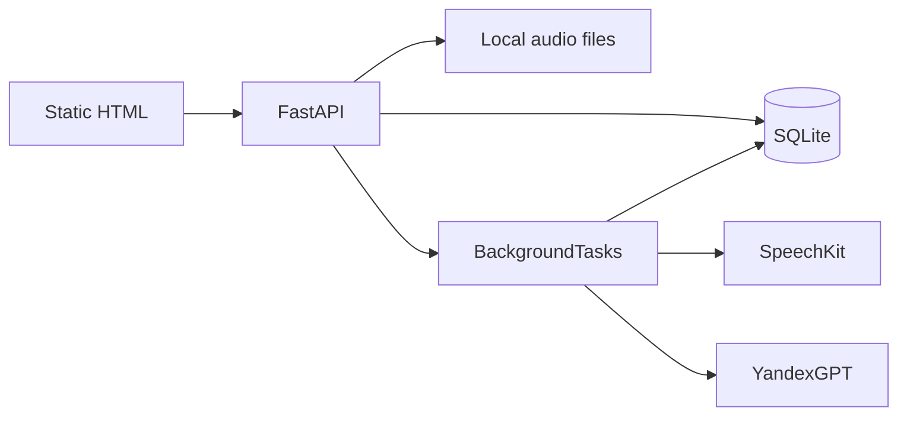

# План: SpeechAI — анализ консультаций

> **Редактирование:** этот файл обновляется по мере развития проекта. При правках агент предупреждает в чате.

## Суть проекта

Сервис для стоматологической клиники: загрузка аудиозаписи первичной консультации → транскрипция (Yandex SpeechKit) → оценка работы врача по 6 этапам (YandexGPT) → просмотр на простом веб-сайте.

## Текущий фокус: MVP 1.1

**Цель:** загрузить MP3 и увидеть на сайте транскрипт + отчёт об оценке, а также управлять пользователями врачей и входом по ссылке.

**Не делаем в MVP (отложено):**

- Celery, Redis, Beat
- публикация образов через внешний registry
- PostgreSQL / Alembic (достаточно SQLite)
- S3 / MinIO
- Опрос внешнего REST API
- Поиск, фильтры, лэндинг
- React / отдельный фронтенд-сборщик
- ffmpeg (только MP3/WAV, что принимает SpeechKit)
- Админка критериев

**Делаем в MVP:**

- FastAPI + SQLite + локальные файлы
- Простая админка с пользователями
- `admin` видит все записи и управляет пользователями
- Врачи входят по ссылке из 1С, видят редактируемый блок `Данные из 1С` и работают только со своими записями
- `POST /api/consultations/upload` (multipart: mp3, врач, пациент, дата)
- Фоновая обработка (`BackgroundTasks`)
- SpeechKit STT v3 (async) + YandexGPT с промптом из `config/evaluation_prompt.txt`
- Простой статический UI (HTML/CSS/JS из `backend/app/static`)
- Список записей + карточка (транскрипт, оценка)
- `MOCK_AI=true` — демо без ключей Yandex

## Целевой стек (полная версия)

| Слой | Технология |
|------|------------|
| Backend | Python 3.12+, FastAPI |
| Очередь (позже) | Celery + Redis |
| БД (позже) | PostgreSQL + Alembic |
| Файлы (позже) | S3-совместимое хранилище |
| STT | Yandex SpeechKit STT API v3 |
| Оценка | YandexGPT |
| Фронт (позже) | React или расширение текущего static |
| Ingestion (позже) | `PollingRestAdapter` к внешнему API |

## Пользователи 1.1

- `admin` - полный доступ, управление пользователями
- Врачи - отдельные учётные записи, вход по подписанной ссылке
- Старый общий `doctor` больше не используется

## Критерии оценки (6 этапов, шкала 1–5)

1. Установление контакта  
2. Сбор анамнеза  
3. Диагностика и осмотр  
4. Презентация лечения  
5. Работа с возражениями  
6. Завершение визита  

Промпт: [`config/evaluation_prompt.txt`](../config/evaluation_prompt.txt)

## Этапы после MVP

1. Реальный poll внешнего API + адаптеры  
2. PostgreSQL, S3  
3. Поиск и фильтры на сайте  
4. Улучшение UI  
5. Админка критериев

## Архитектура MVP

## Статусы записи

`uploaded` → `processing` → `ready` | `failed`

## API MVP

| Метод | Путь | Описание |
|-------|------|----------|
| POST | `/api/auth/login` | Вход в админку |
| POST | `/api/auth/logout` | Выход |
| GET | `/api/auth/me` | Текущий пользователь |
| POST | `/api/consultations/upload` | Загрузка MP3 + метаданные |
| GET | `/api/consultations` | Список с учётом роли |
| GET | `/api/consultations/{id}` | Карточка с учётом роли |
| DELETE | `/api/consultations/{id}` | Удаление записи с учётом роли |
| GET | `/health` | Healthcheck |

## Пользователи MVP

- `admin` / `V9k2Qm4R` — полный доступ ко всем записям и учёткам
- `Кухтарская Татьяна` / `T4n8Kq1a`
- `Кудзиева Тамара` / `Tm6zP2rH`
- `Иваненчук Иван` / `Iv9nQ3sB`
- `Корнилова Анастасия` / `An5kV8dR`

## Что нужно от заказчика

- `YANDEX_API_KEY` или IAM + `YANDEX_FOLDER_ID`
- Тестовый MP3 консультации
- (опционально) имена врача/пациента для демо

## Деплой на Render

- Основной публичный хостинг для MVP: Render
- Render подключается к GitHub-репозиторию и сам собирает Docker-образ из `Dockerfile`
- Для SQLite и аудиофайлов нужен persistent disk, смонтированный в `/data`
